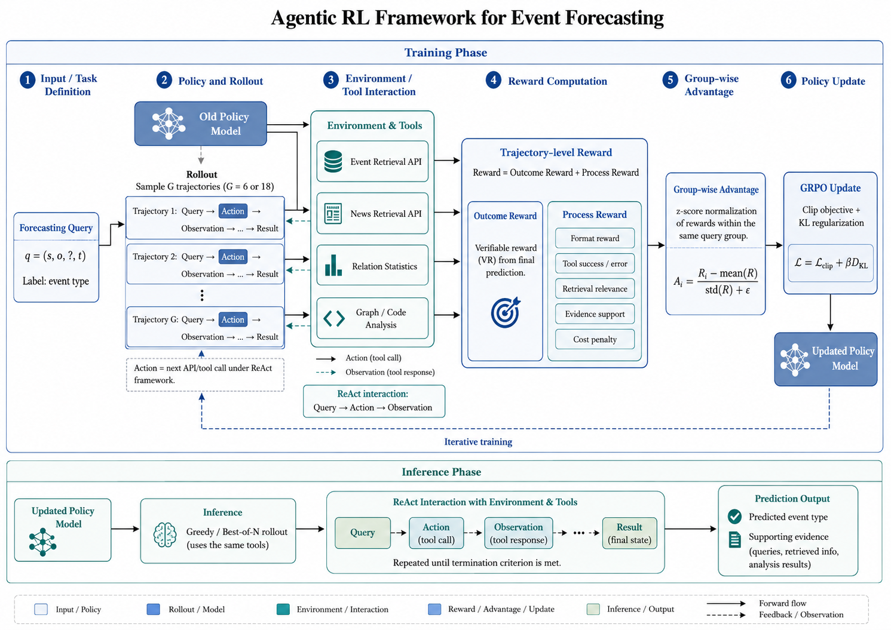

# Agentic Reinforcement Learning for Event Forecasting

This repository implements an agentic reinforcement learning framework for event forecasting. The current codebase provides a runnable research prototype covering temporal data construction, tool-augmented environment interaction, ReAct-style rollout generation, trajectory-level reward design, group-wise advantage estimation, GRPO-style training statistics, inference, and evaluation.



## 1. Research Goal

Given a forecasting query $q=(s,o,?,t)$, where $s$ and $o$ are the subject and object entities, $t$ is the target timestamp, and `?` denotes the unknown future event type, the goal is to predict the event label $y$ that will occur between the entity pair at time $t$.

Each event is represented as a structured tuple $(t,s,r,o)$, where $r$ denotes the relation or event type. Instead of directly predicting $r$ from parametric knowledge alone, this project formulates event forecasting as an agentic decision-making process. The agent must actively retrieve historical evidence, query textual news evidence, analyze relation patterns, and then produce an evidence-grounded prediction.

## 2. Current Implementation

The repository currently contains a lightweight Python implementation that does not require external dependencies. It is designed as an extensible MVP: the rule-based policy can be replaced by an LLM policy, and the GRPO statistics module can be connected to a PyTorch/Transformers optimizer later.

```text
src/agentic_event_forecasting/
  data/          CSV loading, chronological split, query construction
  tools/         event retrieval, news retrieval, relation statistics, graph analysis
  env/           ReAct-style action execution environment
  agent/         policy interface and heuristic ReAct baseline
  rollout/       group trajectory generation
  reward/        outcome reward and process reward
  trainer/       group-wise advantage and GRPO objective statistics
  inference/     single-run and best-of-N prediction
  evaluation/    prediction and tool-use metrics
examples/        toy event/news data for local demo
scripts/         runnable demo entry points
tests/           unit tests for the core pipeline
```

Run the local demo:

```bash
python3 scripts/run_demo.py
```

Run tests:

```bash
PYTHONPATH=src python3 -m unittest discover -s tests
```

## 3. Core Framework

The framework follows a ReAct-style agent-environment interaction paradigm. For each query, the policy model alternates between generating an action and receiving an observation from the environment:

$$
\tau=(q,a_1,o_1,a_2,o_2,\ldots,a_K,o_K,\hat{y}),
$$

where $a_k$ is a tool/API action, $o_k$ is the returned observation, and $\hat{y}$ is the final predicted event label.

The environment will provide multiple evidence-oriented tools:

| Tool Category | Purpose |
| --- | --- |
| Event Retrieval API | Retrieve historical events related to the target entities, entity pair, relations, and time window. |
| News Retrieval API | Retrieve relevant news articles before the target timestamp. |
| Relation Statistics | Compute historical relation distributions and temporal frequency patterns. |
| Graph Analysis | Analyze local temporal graph neighborhoods, entity interaction histories, and multi-hop evidence. |
| Execution Feedback | Return structured observations, retrieved evidence, analysis results, or error messages. |

## 4. Implementation Plan

### 4.1 Data and Task Construction

The first step is to build a temporally consistent event forecasting benchmark. Raw events will be normalized into tuples $(t,s,r,o)$, and forecasting queries will be generated as $(s,o,?,t)$. The train, validation, and test splits must strictly follow chronological order to avoid future information leakage.

For each query, the system should prepare:

- the ground-truth event label;
- candidate relation/event labels;
- historical events before the target timestamp;
- optional news documents indexed by time, entity, and relation keywords;
- metadata for entity aliases and relation descriptions.

### 4.2 Environment and Tool Layer

The environment is responsible for executing agent actions and returning observations. Each tool should have a clearly defined input schema, output schema, error handling rule, and cost accounting mechanism. The environment should reject illegal timestamps, unsupported entities, invalid arguments, repeated redundant calls, and unsafe execution requests.

The tool layer should support both structured and unstructured evidence retrieval. Structured tools focus on temporal event databases, while textual tools retrieve news articles and contextual descriptions. This separation makes it possible to analyze whether the final prediction is supported by historical graph evidence, textual evidence, or both.

### 4.3 Agent and Rollout Generation

During training, an old policy model $\pi_{\theta_{\mathrm{old}}}$ will generate multiple candidate trajectories for the same query:

$$
\{\tau_1,\tau_2,\ldots,\tau_G\}\sim\pi_{\theta_{\mathrm{old}}}(\cdot|q),
$$

where $G$ can be set to 6 or 18 depending on the compute budget. Each trajectory should record the complete interaction history, including generated tokens, actions, observations, final prediction, and token-level log probabilities under the old policy.

The rollout module should support:

- multi-turn ReAct-style interaction;
- maximum step control;
- termination when a final prediction is produced;
- logging of all actions, observations, errors, and retrieved evidence;
- reproducible sampling with fixed seeds and model checkpoints.

### 4.4 Reward Design

The trajectory-level reward consists of an outcome reward and a process reward:

$$
R(\tau_i)=R_{\mathrm{out}}(\tau_i)+\lambda R_{\mathrm{proc}}(\tau_i).
$$

The outcome reward evaluates whether the final prediction matches the ground-truth label. Depending on the task setting, it can be computed using exact match, accuracy, precision, recall, F1, or other label-level metrics:

$$
R_{\mathrm{out}}(\tau_i)=\mathrm{VR}(\hat{y}_i,y).
$$

The process reward encourages valid and evidence-grounded tool use:

$$
R_{\mathrm{proc}}=
w_fR_{\mathrm{format}}
+w_tR_{\mathrm{tool}}
+w_rR_{\mathrm{retrieval}}
+w_eR_{\mathrm{evidence}}
-w_cC_{\mathrm{cost}}.
$$

The main process-level components are:

- **Format reward:** valid action format and valid final output format.
- **Tool reward:** successful API execution and correct argument usage.
- **Retrieval reward:** relevance of retrieved events, news, and relation statistics.
- **Evidence reward:** consistency between the final prediction and collected evidence.
- **Cost penalty:** repeated calls, invalid calls, excessive tool usage, and unnecessary interaction steps.

This design provides denser supervision than final prediction accuracy alone while keeping the training objective aligned with event forecasting.

### 4.5 Group-wise Advantage Estimation

After collecting $G$ trajectories for the same query, rewards will be normalized within the group:

$$
A_i=\frac{R(\tau_i)-\mu_q}{\sigma_q+\epsilon},
$$

where $\mu_q$ and $\sigma_q$ are the mean and standard deviation of the trajectory rewards for query $q$. This group-relative advantage compares multiple reasoning paths for the same forecasting query and is suitable for agentic settings where different tool-use strategies may lead to different prediction quality.

### 4.6 GRPO Training

The policy model will be optimized with Group Relative Policy Optimization (GRPO). Compared with PPO, GRPO does not require an explicit critic model. It estimates the relative quality of sampled trajectories through group-wise reward normalization.

For each generated token, the probability ratio is:

$$
r_{i,k}(\theta)=
\frac{\pi_\theta(a_{i,k}|h_{i,k})}
{\pi_{\theta_{\mathrm{old}}}(a_{i,k}|h_{i,k})},
$$

where $h_{i,k}$ is the interaction history before generating token $a_{i,k}$. The clipped objective stabilizes policy updates:

$$
\mathcal{L}_{\mathrm{clip}}
=-\frac{1}{G}\sum_{i=1}^{G}
\frac{1}{|\tau_i|}
\sum_k
\min\left(
r_{i,k}(\theta)A_i,
\mathrm{clip}(r_{i,k}(\theta),1-\epsilon,1+\epsilon)A_i
\right).
$$

The final objective includes KL regularization against a frozen reference policy:

$$
\mathcal{L}
=\mathcal{L}_{\mathrm{clip}}
+\beta D_{\mathrm{KL}}(\pi_\theta\|\pi_{\mathrm{ref}}).
$$

High-reward trajectories should become more likely under the updated policy, while trajectories with invalid tool calls, irrelevant retrieval, unsupported reasoning, or incorrect predictions should be suppressed.

### 4.7 Inference

During inference, the optimized policy receives a query $q=(s,o,?,t)$ and interacts with the same environment. The agent retrieves historical and textual evidence, integrates structured event patterns with contextual news information, and outputs the predicted event type $\hat{y}$.

The final output should include:

- predicted event label;
- retrieved supporting events;
- relevant news evidence;
- relation statistics or graph analysis results;
- concise explanation of why the prediction is supported.

## 5. Evaluation Plan

The project should evaluate both forecasting performance and agent behavior.

| Evaluation Aspect | Suggested Metrics |
| --- | --- |
| Event Prediction | Accuracy, macro-F1, micro-F1, precision, recall |
| Evidence Quality | retrieval relevance, evidence support rate |
| Tool Use | tool success rate, invalid call rate, average interaction steps |
| Efficiency | token cost, number of tool calls, inference latency |
| Robustness | performance under missing news, sparse history, or noisy retrieval |

The main comparisons should include non-agentic event forecasting models, retrieval-augmented LLM baselines, supervised fine-tuning baselines, and ablations without process reward, without news retrieval, without graph analysis, or without GRPO.

## 6. Development Milestones

1. **Benchmark preparation:** construct temporal event queries and chronological data splits.
2. **Environment construction:** implement event retrieval, news retrieval, relation statistics, and graph analysis tools.
3. **Agent rollout:** generate multi-step ReAct trajectories with the old policy model.
4. **Reward module:** combine verifiable outcome reward with process-level supervision.
5. **GRPO training:** optimize the policy with group-wise advantages and KL regularization.
6. **Inference pipeline:** produce event predictions with supporting evidence.
7. **Evaluation and ablation:** evaluate prediction accuracy, tool behavior, cost, and interpretability.

## 7. Expected Contribution

This project aims to build an interpretable event forecasting framework that combines temporal knowledge graph reasoning, news-grounded evidence retrieval, and agentic reinforcement learning. The central hypothesis is that training the model to actively collect and use evidence can improve both forecasting accuracy and the verifiability of future event predictions.
